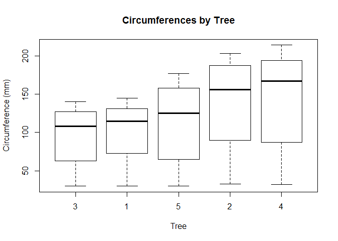
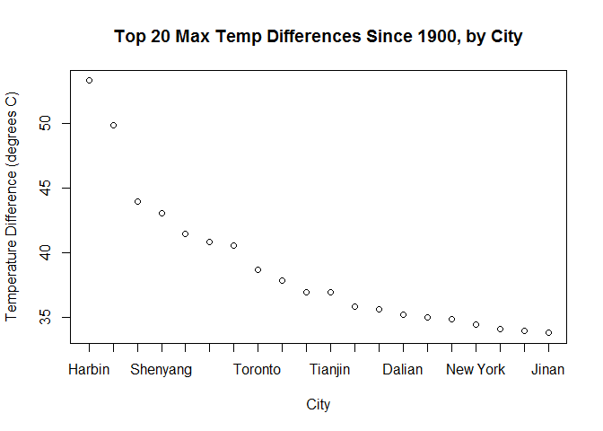

# Case Study 2
Kevin Cannon  
December 8, 2016  


# Question 01
Create the X matrix and print it from SAS, R, and Python.

## SAS Code
proc iml;
Xsas = {4 5 1 2, 1 0 3 5, 2 1 8 2};
print Xsas;

## R Code

```r
XR <- matrix(c(4,1,2,5,0,1,1,3,8,2,5,2),nrow=3,ncol=4)
XR
```

```
##      [,1] [,2] [,3] [,4]
## [1,]    4    5    1    2
## [2,]    1    0    3    5
## [3,]    2    1    8    2
```

## Python Code

```python
import numpy
Xpython = numpy.matrix('4 5 1 2; 1 0 3 5; 2 1 8 2')
print(Xpython)
```

```
## [[4 5 1 2]
##  [1 0 3 5]
##  [2 1 8 2]]
```

# Question 2
Week 11 Lecture Assignment. Please watch videos1 and 2 in week 11 lecture assignment. The code used for S&P is included in the same zip folder as this assignment. Here are your assigned stocks, by first name:
Kevin C. - CO

Perform the following tasks with your assigned stock: 
## Download the data.

```r
library(tseries)
```

```
## Warning: package 'tseries' was built under R version 3.3.2
```

```r
COdata <- get.hist.quote('CO', quote="Close")
```

```
## time series starts 2007-05-09
```

## Calculate log returns.

```r
COreturns <- log(lag(COdata)) - log(COdata)
length(COreturns)
```

```
## [1] 2415
```

## Calculate volatility measure.
### Assumption: 250 trading days/year

```r
COvol <- sd(COreturns)*sqrt(250)*100
COvol
```

```
## [1] 49.10638
```

## Calculate volatility over entire length of series for the different decay factors.
### First, create a volatility function:

```r
vol <- function(d, logrets){
  var=0
  lam=0
  varlist<- c()
  for (r in logrets){
    lam = lam*(1 - 1/d) + 1
  var = (1 - 1/lam)*var + (1/lam)*r^2
    varlist <-c(varlist, var)
  }
  sqrt(varlist)
}
```

### Run volatility function with different decay factors:

```r
volest <- vol(10,COreturns)
volest2 <- vol(30,COreturns)
volest3 <- vol(100,COreturns)
```

## Plot the results, overlaying the volatility curves on the data, just as was done in the S&P example.

```r
plot(volest,type="l")
lines(volest2,type="l",col="blue")
lines(volest3,type="l",col="red")
```

<!-- -->

# Question 03
The built-in data set called Orange in R is about the growth of orange trees. The Orange data frame has 3 columns of records of the growth of orange trees.

Variable descriptions:
-Tree: an ordered factor indicating the tree on which the measurement is made. The ordering is according to increasing maximum diameter.
-Age:  a numeric vector giving the age of the tree (days since 1968/12/31) circumference: a numeric vector of trunk circumferences (mm). This is probably "circumference at breast height", a standard measurement in forestry.

## Calculate the mean and the median of the trunk circumferences for different size of the trees. (Tree)

```r
tapply(Orange$circumference, Orange$Tree, mean)
```

```
##         3         1         5         2         4 
##  94.00000  99.57143 111.14286 135.28571 139.28571
```

```r
tapply(Orange$circumference, Orange$Tree, median)
```

```
##   3   1   5   2   4 
## 108 115 125 156 167
```

## Make a scatter plot of the trunk circumferences against the age of the tree. Use different plotting symbols for different size of trees.

```r
library(ggplot2)
ggplot(Orange, aes(x=age, y=circumference, shape=Tree)) + geom_point()
```

<!-- -->

## Display the trunk circumferences on a comparative boxplot against tree. Be sure you order the boxplots in the increasing order of maximum diameter.
### Circumference is a linear function of diameter.

```r
boxplot(Orange$circumference~Orange$Tree, main="Circumferences by Tree", xlab="Tree", ylab="Circumference (mm)")
```

<!-- -->

# Question 04
Using the "Temp" data set

## Q4 (i)
Find the difference between the maximum and the minimum monthly average temperatures for each country and report/visualize top 20 countries with the maximum differences for the period since 1900.

### Download data

```r
temp <- read.csv("F:\\SMU\\MSDS 6306\\Case Study 02\\temp.csv", header=TRUE)
city <- read.csv("F:\\SMU\\MSDS 6306\\Case Study 02\\citytemp.csv", header=TRUE)
```

### Unify date format

```r
YMD <- as.Date(temp$Date,format="%Y-%m-%d") 
MDY <- as.Date(temp$Date,format="%m/%d/%Y")
YMD[is.na(YMD)] <- MDY[!is.na(MDY)]
temp$Date <- YMD
```

###  Remove NA values, change to factor

```r
temp <- temp[!(is.na(temp$Monthly.AverageTemp)),]
temp$Country <- as.factor(temp$Country)
```

### Subset period since 1900

```r
datesubset <- as.Date("1900-01-01")
TempSince1900 <- temp[temp$Date >= datesubset,]
```

### Calculate monthly temperature ranges

```r
Tmax <- tapply(TempSince1900$Monthly.AverageTemp, TempSince1900$Country, max)
Tmin <- tapply(TempSince1900$Monthly.AverageTemp, TempSince1900$Country, min)
Trange <- Tmax - Tmin
```

### Sort top 20 temperature ranges

```r
TrangeSort <- sort(Trange, decreasing=TRUE)
TrangeTop20 <- TrangeSort[1:20]
TrangeTop20
```

```
##   Kazakhstan     Mongolia       Russia       Canada   Uzbekistan 
##       49.163       48.010       46.682       43.532       42.698 
## Turkmenistan      Belarus      Finland      Estonia      Ukraine 
##       40.579       39.338       39.068       38.815       38.660 
##   Kyrgyzstan  North Korea       Latvia      Moldova    Greenland 
##       38.436       38.342       38.063       38.012       37.516 
##      Denmark    Lithuania   Tajikistan       Poland      Armenia 
##       37.138       36.970       35.829       35.616       35.273
```

### Report/visualize top 20 countries

```r
countrynames <- names(TrangeTop20)
plot(TrangeTop20,xaxt="n",xlab="Country",ylab="Temperature Difference (degrees C)",main="Top 20 Max Temp Differences Since 1900, by Country")
axis(1, at=1:length(countrynames), labels=countrynames)
```

<!-- -->

## Q4 (ii)
Select a subset of data and call it "UStemp" for US land temperatures starting from 01/01/1990 in Temp data.

### a)	Create a new column to display the monthly average land temperatures in Fahrenheit (°F).

```r
UStemp <- subset(TempSince1900, Country == "United States")
### Convert from C to F
UStemp$F <- (UStemp$Monthly.AverageTemp * 1.8) + 32
```

### b)	Calculate average land temperature by year and plot it. The original file has the average land temperature by month.


```r
# Cut dates by year
UStemp$Year <- as.Date(cut(UStemp$Date, breaks = "year"))
TempYearAvg <- tapply(UStemp$Monthly.AverageTemp, UStemp$Year, mean)

# Plot land temp by year
countrynames <- substr(names(TempYearAvg), start = 1, stop = 4)
plot(TempYearAvg,xaxt="n")
axis(1, at=1:length(countrynames), labels=countrynames)
```

<!-- -->

```r
TempYearAvg
```

```
## 1900-01-01 1901-01-01 1902-01-01 1903-01-01 1904-01-01 1905-01-01 
##   9.021583   8.494917   8.454000   7.977250   8.200667   8.402333 
## 1906-01-01 1907-01-01 1908-01-01 1909-01-01 1910-01-01 1911-01-01 
##   8.560083   8.394000   8.755583   8.221833   8.757917   8.737917 
## 1912-01-01 1913-01-01 1914-01-01 1915-01-01 1916-01-01 1917-01-01 
##   8.140917   8.552167   8.876500   8.648250   8.180083   7.669500 
## 1918-01-01 1919-01-01 1920-01-01 1921-01-01 1922-01-01 1923-01-01 
##   8.501250   8.538000   8.184500   9.595667   8.768167   8.760333 
## 1924-01-01 1925-01-01 1926-01-01 1927-01-01 1928-01-01 1929-01-01 
##   8.052333   9.016417   9.140250   8.719333   8.876000   8.439500 
## 1930-01-01 1931-01-01 1932-01-01 1933-01-01 1934-01-01 1935-01-01 
##   8.737667   9.560750   8.539500   9.030583   9.826583   8.742500 
## 1936-01-01 1937-01-01 1938-01-01 1939-01-01 1940-01-01 1941-01-01 
##   8.922250   8.730750   9.471833   9.307500   9.097167   9.266083 
## 1942-01-01 1943-01-01 1944-01-01 1945-01-01 1946-01-01 1947-01-01 
##   8.919333   9.003500   8.898167   8.671250   9.179583   8.836083 
## 1948-01-01 1949-01-01 1950-01-01 1951-01-01 1952-01-01 1953-01-01 
##   8.481667   8.888083   8.656417   8.416583   8.979417   9.530417 
## 1954-01-01 1955-01-01 1956-01-01 1957-01-01 1958-01-01 1959-01-01 
##   9.410583   8.517167   8.699917   9.126333   8.970167   8.825333 
## 1960-01-01 1961-01-01 1962-01-01 1963-01-01 1964-01-01 1965-01-01 
##   8.692250   8.642000   8.956500   9.080000   8.491667   8.647667 
## 1966-01-01 1967-01-01 1968-01-01 1969-01-01 1970-01-01 1971-01-01 
##   8.483000   8.902000   8.553250   8.770833   8.673000   8.442500 
## 1972-01-01 1973-01-01 1974-01-01 1975-01-01 1976-01-01 1977-01-01 
##   8.428083   8.934667   8.815917   8.431000   8.651250   9.269833 
## 1978-01-01 1979-01-01 1980-01-01 1981-01-01 1982-01-01 1983-01-01 
##   8.751417   8.571583   9.135500   9.721500   8.539500   8.912333 
## 1984-01-01 1985-01-01 1986-01-01 1987-01-01 1988-01-01 1989-01-01 
##   8.811167   8.587000   9.559500   9.628167   9.275333   8.873083 
## 1990-01-01 1991-01-01 1992-01-01 1993-01-01 1994-01-01 1995-01-01 
##   9.521583   9.493667   9.056333   8.867250   9.270333   9.331000 
## 1996-01-01 1997-01-01 1998-01-01 1999-01-01 2000-01-01 2001-01-01 
##   8.754333   9.172917  10.141167   9.567000   9.649750   9.785583 
## 2002-01-01 2003-01-01 2004-01-01 2005-01-01 2006-01-01 2007-01-01 
##   9.816167   9.755083   9.667500   9.892667   9.974500   9.837500 
## 2008-01-01 2009-01-01 2010-01-01 2011-01-01 2012-01-01 2013-01-01 
##   8.951417   9.137083   9.505583   9.549917  10.261083  11.297111
```

### c)	Calculate the one year difference of average land temperature by year and provide the maximum difference (value) with corresponding two years.

```r
USTdiffYear <- diff(TempYearAvg)
SortUSTdiffYear <- sort(USTdiffYear, decreasing=TRUE)
SortUSTdiffYear[1]
```

```
## 1921-01-01 
##   1.411167
```
The maximum value corresponds to the years 1920-1921.

## Q4 (iii)
Using the "CityTemp" data set

### a) Find the difference between the maximum and the minimum temperatures for each major city and report/visualize top 20 cities with maximum differences for the period since 1900.

### Download data

```r
city <- read.csv("F:\\SMU\\MSDS 6306\\Case Study 02\\citytemp.csv", header=TRUE)
```

### Unify date format

```r
YMD <- as.Date(city$Date,format="%Y-%m-%d") 
MDY <- as.Date(city$Date,format="%m/%d/%Y")
YMD[is.na(YMD)] <- MDY[!is.na(MDY)]
city$Date <- YMD
```

###  Remove NA values, change to factor

```r
city <- city[!(is.na(city$Monthly.AverageTemp)),]
city$City <- as.factor(city$City)
```

### Subset period since 1900

```r
datesubset <- as.Date("1900-01-01")
CityTempSince1900 <- city[city$Date >= datesubset,]
```

### Calculate monthly temperature ranges

```r
Tmaxcity <- tapply(CityTempSince1900$Monthly.AverageTemp, CityTempSince1900$City, max)
Tmincity <- tapply(CityTempSince1900$Monthly.AverageTemp, CityTempSince1900$City, min)
Trangecity <- Tmaxcity - Tmincity
```

### Sort top 20 temperature ranges

```r
TrangecitySort <- sort(Trangecity, decreasing=TRUE)
TrangecityTop20 <- TrangecitySort[1:20]
TrangecityTop20
```

```
##           Harbin        Changchun           Moscow         Shenyang 
##           53.281           49.844           43.956           43.045 
##         Montreal             Kiev Saint Petersburg          Toronto 
##           41.422           40.784           40.510           38.683 
##          Taiyuan           Peking          Tianjin            Seoul 
##           37.834           36.953           36.953           35.783 
##          Mashhad           Dalian          Chicago         Tangshan 
##           35.610           35.223           34.962           34.833 
##         New York          Baghdad           Berlin            Jinan 
##           34.460           34.047           33.920           33.778
```

### Report/visualize top 20 cities

```r
cityynames <- names(TrangecityTop20)
plot(TrangecityTop20,xaxt="n",xlab="City",ylab="Temperature Difference (degrees C)",main="Top 20 Max Temp Differences Since 1900, by City")
axis(1, at=1:length(cityynames), labels=cityynames)
```

<!-- -->

### b) Compare the two graphs in (i) and (iii) and comment on your comparison
A graphical comparison of the top 20 largest differences between the maximum and the minimum monthly average temperatures of countries and cities for the period since 1900 shows strong similarities. As expected, there is a correlation between with large temperature fluctuations and their corresponding countries. Overall, few cities or countries experience temperature differences of 50 degrees celcius, indicating that many climates and locations sustain fairly consistent temperatures. The slopes of both the country and city graphs begin to flatten at the lower end of the top 20 observations, which may mean that the temperature differences approach some asymptotic value representing a baseline temperature difference.
